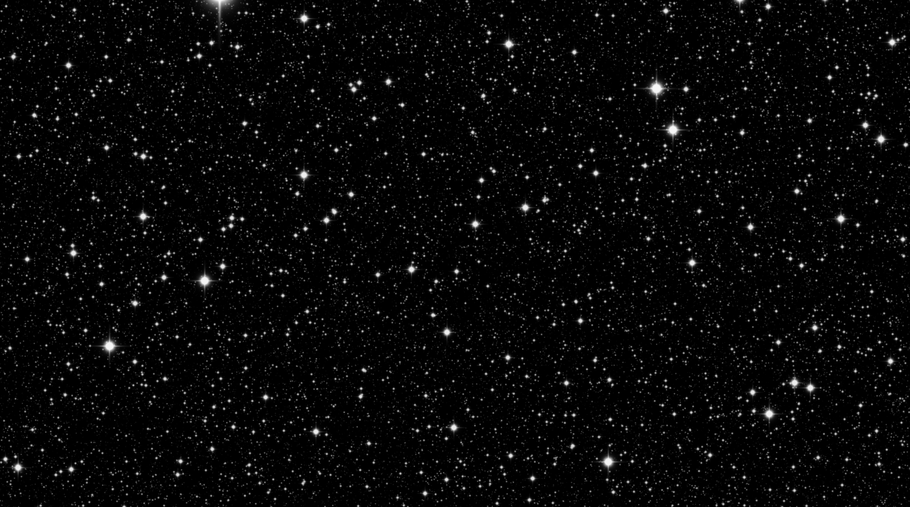

# infinite-star-sky-sim
Infinite star sky simulation using C++ and SFML library.

### Required tools:
C++, SFML library, MINGW

### Windows Powershell execution:

Enter the src directory:

```PS ...> cd src```

Compile and execute:

```PS ...> mingw32-make```

### Sample images:



### Helpful tutorial video:
https://www.youtube.com/watch?v=t0z3RojiKFg

\[Project created in October 2024\]